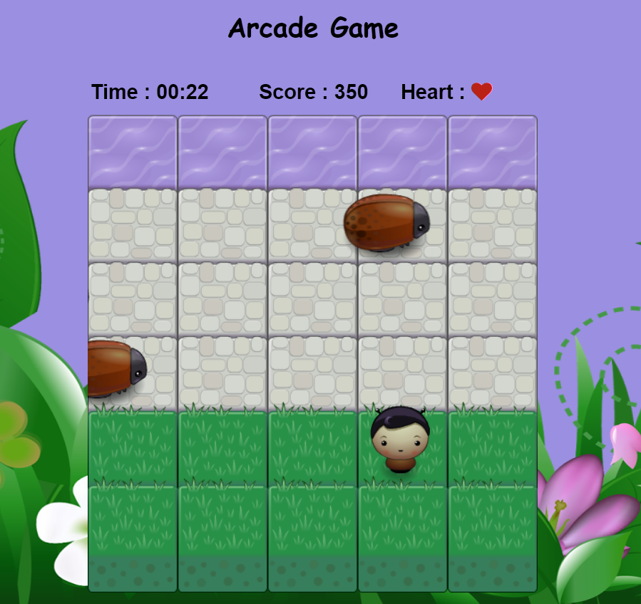
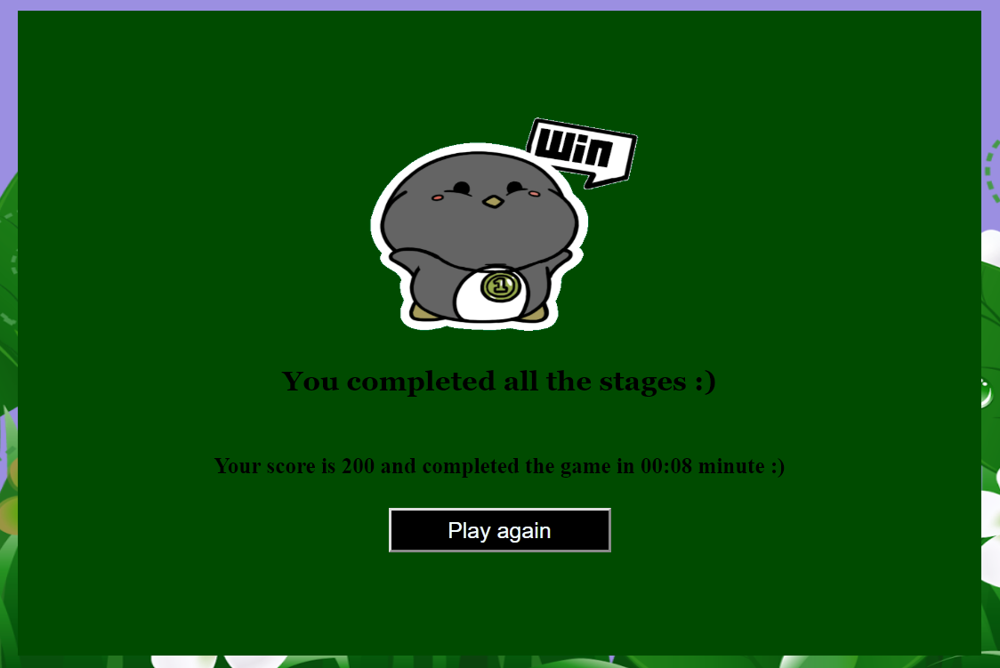
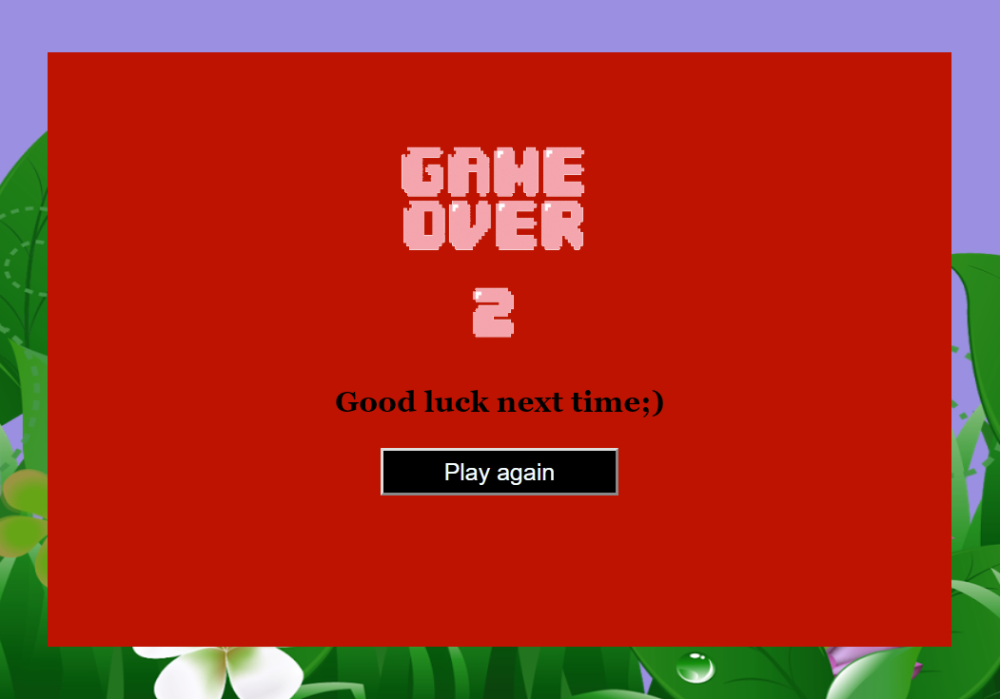

# Frogger Arcade Game
The game is built using Javascript.

## How to play
 If you reach the water then you will reach next level, if you run into an enemy bug then you will die and the game will start over. The enemy bugs are running across the screen at random speeds. There are total of 5 stages and you will have three lives, if you run over a bug your life will reduce and if you collect heart then your life will increase. To win the game you need to complete all 5 stages.

## How to use the controls
Use the arrow keys to move left, right, forward or backward.

##Files included

1) style.css
        - css file for index.html which is used for styling the front-end8553675312.

2) images
        - Consists of images used in game and the the Used resources.

3) js
    i)app.js
        - Contains javascript code that handles game functionality 
    ii)engine.js
	   - Contains game loop functionality 
	   - Draws the initial game board on the screen,
	   - Calls update, render methods on player and enemy objects 
    iii)resource.js
	   - It is a image loading utility

4) index.html
        - Displays web contents of game
        - Canvases the game
        - The Timer starts with the game start.
        - The Player Score and lifes

5) readme.txt
    - States Overall description of project
    
    
&ensp;

&ensp;

&ensp;